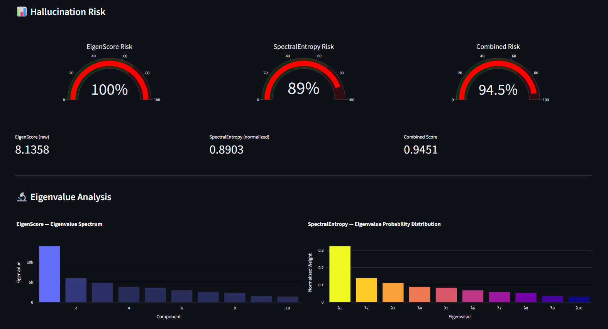

# 🔬 HalluScope

LLM hallucination detection using internal hidden states.
Implements **EigenScore** (INSIDE, ICLR 2024) and introduces a novel
**SpectralEntropy** metric on top of it, evaluated on Phi-2.



## Setup

```bash
git clone https://github.com/0xkerem/halluscope
cd halluscope
pip install -r requirements.txt
```

## Run

```bash
# Streamlit demo
streamlit run app/main.py

# CLI benchmark
python run_benchmark.py --dataset triviaqa --samples 100
```

## Project Structure

```
core/
  model.py            → Phi-2 loading + multi-response generation
  embeddings.py       → Penultimate layer sentence embeddings
  eigenscore.py       → EigenScore (INSIDE paper)
  spectral_entropy.py → SpectralEntropy (new contribution)
  feature_clip.py     → Test-time feature clipping
eval/                 → Dataset loaders, AUROC/PCC evaluation
app/                  → Streamlit multi-page UI
utils/                → Config, Plotly visualizations
```

## Novel Contribution: SpectralEntropy

EigenScore measures the *volume* of the semantic spread (log-determinant).
SpectralEntropy measures the *uniformity* of that spread (Shannon entropy
over normalized eigenvalues). Together they capture both magnitude and
shape of the response distribution, yielding the **Combined** score.

## Citation

This project builds on INSIDE: *LLMs' Internal States Retain the Power of Hallucination Detection* by Chen et al. (ICLR 2024). The paper proposes using LLMs' internal hidden states for hallucination detection and introduces the EigenScore metric. Available on [arXiv](https://arxiv.org/abs/2402.03744).